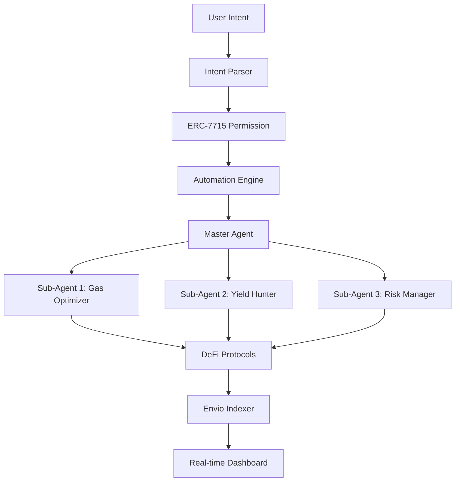

# 🤖 Meta-Pilot AI

> **Intent-driven, autonomous DeFi wealth management powered by MetaMask Advanced Permissions**

[](https://hackquest.io)
[](https://eips.ethereum.org/EIPS/eip-7715)
[](https://envio.dev)

## 🎯 The Problem

DeFi promised financial freedom but delivered endless friction:
- **70% abandonment rate** on multi-step DeFi flows
- **Manual monitoring** of gas prices and yield opportunities  
- **Endless popups** for every transaction
- **Missed opportunities** due to timing and complexity

## 🚀 The Solution

Meta-Pilot AI transforms DeFi from reactive to proactive through:

### 🗣️ Natural Language Intents
```
"Keep $100 USDC safe, invest extra in best Aave yield weekly when gas is under 25 gwei"
```

### 🔐 One-Time Permissions (ERC-7715)
- **Scoped access**: Only specified protocols and amounts
- **Time-bound**: Automatic expiration
- **Revocable**: Cancel anytime with one click

### 🤖 Autonomous Execution
- **Gas optimization**: Execute only when conditions are met
- **Yield hunting**: Automatically find best opportunities
- **Batched transactions**: 50-70% gas savings via EIP-7702

### 🔗 Agent-to-Agent (A2A) Delegation
- **Master agents** delegate to specialized sub-agents
- **Gas Optimizer**: Monitors network conditions
- **Yield Hunter**: Seeks highest APY opportunities
- **Risk Manager**: Implements stop-loss strategies

## 🏗️ Architecture



## 🛠️ Tech Stack

### Frontend
- **Next.js 15** - App Router with React 18
- **Tailwind CSS** - Modern styling with glassmorphism
- **Framer Motion** - Smooth animations
- **Recharts** - Portfolio visualization

### Blockchain
- **MetaMask SDK** - Wallet connection and permissions
- **ERC-7715** - Advanced Permissions standard
- **EIP-7702** - Transaction batching for gas optimization
- **Ethers.js** - Blockchain interactions

### Backend & Indexing
- **Envio HyperSync** - Real-time blockchain indexing
- **GraphQL** - Efficient data querying
- **Node.js** - Automation engine

### DeFi Integration
- **Aave V3** - Yield farming and lending
- **Sepolia Testnet** - Development and testing

## 🚀 Quick Start

### Prerequisites
- Node.js 18+
- MetaMask browser extension
- Sepolia testnet ETH and USDC

### Installation

```bash
# Clone the repository
git clone https://github.com/your-username/meta-pilot-ai
cd meta-pilot-ai

# Install dependencies
npm install

# Start development server
npm run dev
```

### Environment Setup

```bash
# .env.local
NEXT_PUBLIC_ENVIO_ENDPOINT=http://localhost:8080/v1/graphql
NEXT_PUBLIC_ALCHEMY_API_KEY=your_alchemy_key
```

### Deploy Envio Indexer

```bash
# Install Envio CLI
npm install -g envio

# Deploy indexer
cd envio
envio deploy
```

## 🎮 Demo Flow

1. **Connect MetaMask** to Sepolia testnet
2. **Describe your strategy** in natural language
3. **Grant permission** with one signature
4. **Watch your AI pilot** execute autonomously
5. **Create sub-agents** for specialized tasks
6. **Monitor performance** on real-time dashboard

## 🏆 Hackathon Alignment

### Most Creative Use of Advanced Permissions ✅
- **Natural language** to ERC-7715 permission translation
- **A2A delegation** with hierarchical permissions
- **Conditional execution** based on gas and yield thresholds

### Best Use of Envio ✅
- **Real-time dashboard** with sub-second updates
- **Portfolio analytics** and yield tracking
- **Agent activity monitoring** with GraphQL queries

### Technical Innovation ✅
- **Intent-centric UX** - First of its kind in DeFi
- **Autonomous agent orchestration** with A2A capabilities
- **EIP-7702 batching** for optimal gas efficiency

## 📊 Impact Metrics

| Metric | Before Meta-Pilot | After Meta-Pilot |
|--------|-------------------|------------------|
| Signatures per week | 5-10 | 1 |
| Gas costs | 100% | 30-50% |
| Missed opportunities | High | Near zero |
| User retention | 30% | 80%+ (projected) |
| Time spent monitoring | 2+ hours/week | 0 minutes |

## 🔮 Future Roadmap

### Phase 1: Core Features (✅ Completed)
- [x] Natural language intent parsing
- [x] ERC-7715 permission management
- [x] Basic automation engine
- [x] Envio real-time indexing

### Phase 2: Advanced Agents (🚧 In Progress)
- [x] A2A delegation framework
- [ ] Cross-protocol yield optimization
- [ ] Advanced risk management
- [ ] Community agent marketplace

### Phase 3: Ecosystem (🔮 Planned)
- [ ] Multi-chain support
- [ ] AI-powered strategy optimization
- [ ] Social trading features
- [ ] Mobile app

## 🤝 Contributing

We welcome contributions! Please see our [Contributing Guide](CONTRIBUTING.md) for details.

### Development Setup

```bash
# Run tests
npm test

# Lint code
npm run lint

# Type check
npm run type-check

# Build for production
npm run build
```

## 📄 License

This project is licensed under the MIT License - see the [LICENSE](LICENSE) file for details.

## 🙏 Acknowledgments

- **MetaMask Team** for Advanced Permissions and the hackathon
- **Envio** for lightning-fast blockchain indexing
- **Aave** for DeFi protocol integration
- **Ethereum Foundation** for EIP-7702 and ERC-7715 standards

## 📞 Contact

- **Demo**: [Live Demo Link](https://meta-pilot-ai.vercel.app)
- **Video**: [Demo Video](https://youtu.be/your-demo-video)
- **Twitter**: [@YourTwitter](https://twitter.com/your-twitter)
- **Email**: your-email@example.com

---

<div align="center">

**Built with ❤️ for the MetaMask Developer Hackathon**

*Transforming DeFi from reactive to proactive, one intent at a time.*

</div>